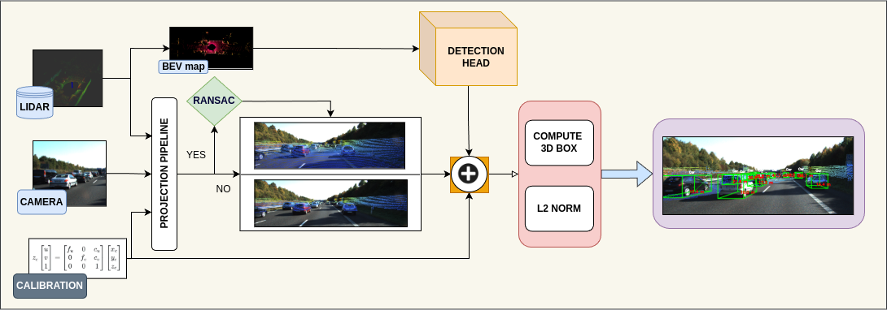

# Lightweight Sensor Fusion Network for Visual Perception

Robust perception with low computation is pivotal for safe navigation in modern robotics and autonomous driving. Yet most existing solutions rely on heavy post processing, two stage matching, which inflates latency, memory and engineering complexity. To address these limitations, We introduce an end-to-end fusion pipeline that exploits Lidar geometry and camera semantics without any post-hoc 2D/3D association.  
In this proposed pipeline, raw lidar sweeps are rasterized into a three channel bird’s-eye-view(BEV) grid, then the lightweight ResNet KFPN backbone regresses fully metrised 7-DoF bounding boxes in a single anchor free pass and within each detection the closest inlier point provides an explicit forward range supplying minimum computation. This network employees the compute aware preprocessing, ROI cropping plus a one shot RANSAC ground filter that cuts the point load by \(\approx60\%\). While FP16 quantization shrinks the model by 30\%. The Network benchmarked on KITTI dataset and the model attains \(70.7\,\text{mAP}\) which is comparably higher than the baseline models. Finally, the complete pipeline is packaged as a ROS node, which streams depth aware overlays in real time, meeting the tight latency and memory budgets of embedded robotic and autonomous vehicle platforms.




<p align="center"><i> Figure : Lidar and camera data passed to projection module that the point cloud is optionally ground filtered before rendering onto the image. Simultaneously, the Lidar sweep is rasterized into a BEV map that feeds to detection head. Fused detections and depth cues are combined to compute full 3D bounding boxes. /i></p>

##  Run Locally
### Requirement

```shell script
git clone https://github.com/Praveenkottari/deep-3d-visual-perception.git
cd deep-3d-visual-perception/
pip install -r requirements.txt
```

#### Training

##### Single machine, single gpu

```shell script
python train.py --gpu_idx 0
```
#### Inference

The pre-trained model was pushed to this repo.

```
python fusion_3d.py 
```


## Folder structure

```
${ROOT}
└── weights/    
    ├── best.pth
    ├── best1.pth
└── calibration/    
    ├── calib.txt
└── ros/    
    ├──detedcted3d_ws/
           ├── src
    ├──pc_ws/
         ├── src
    ├──ros1_ws/
           ├── src
    ├──ros2real_ws/
           ├── src
└── dataset/    
    └── data/
        ├──ImageSets/
        │   ├── test.txt
        │   ├── train.txt
        │   └── val.txt
        ├── training/
        │   ├── image_2/ (left color camera)
        │   ├── image_3/ (right color camera)
        │   ├── calib/
        │   ├── label_2/
        └── testing/  
        │   ├── image_2/ (left color camera)
        │   ├── image_3/ (right color camera)
        │   ├── calib/
        └── classes_names.txt
└── src/
    ├── train/
    │   ├── train_config.py
    │   └── kitti_config.py
    ├── pkgs/
    │   ├── kitti_dataloader.py
    │   ├── kitti_dataset.py
    │   └── kitti_data_utils.py
    ├── heads/
    │   ├── fpn_resnet.py
    │   ├── resnet.py
    │   ├── model_utils.py
    └── BEV/
    │   ├── bev.py
    ├── fusion_3d.py

├── README.md 
└── requirements.txt
```

## Acknowledgements

 - [RTM 3D](https://arxiv.org/abs/2001.03343)
 - [Focal Loss]([https://github.com/maudzung/SFA3D.git](https://arxiv.org/abs/1708.02002))
 - [SFA 3D](https://github.com/maudzung/SFA3D.git)


